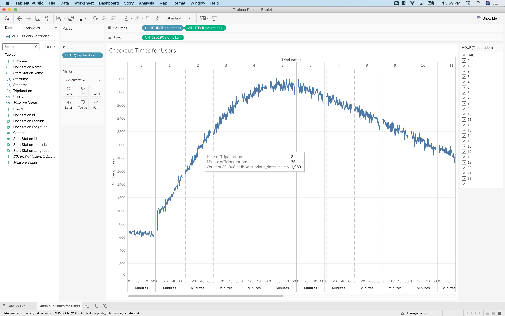
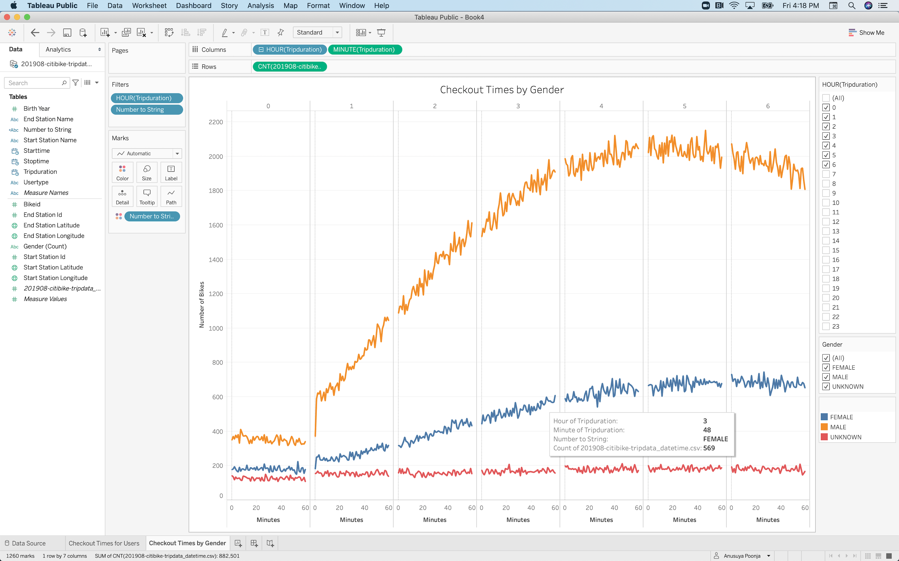
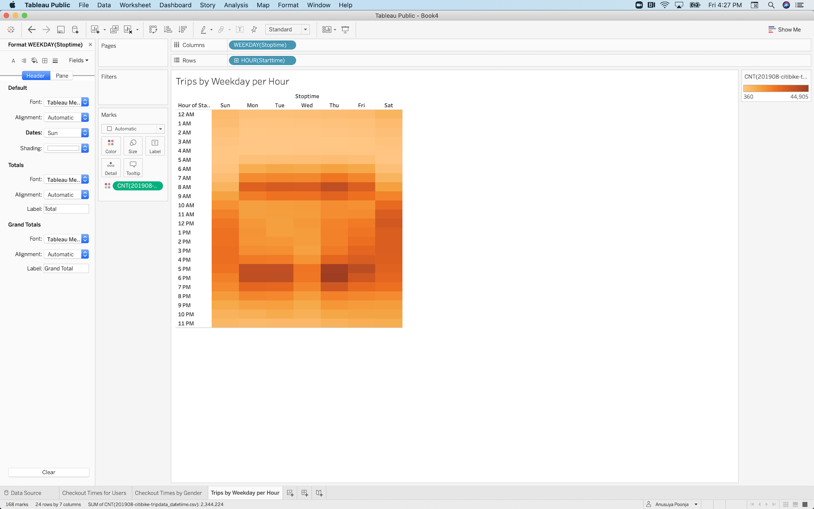
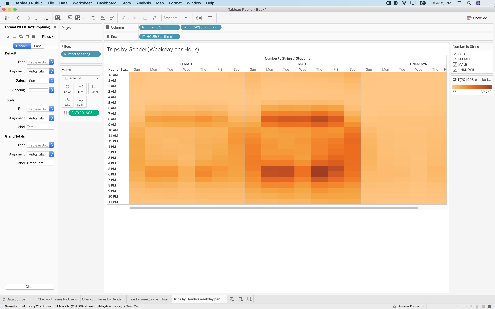
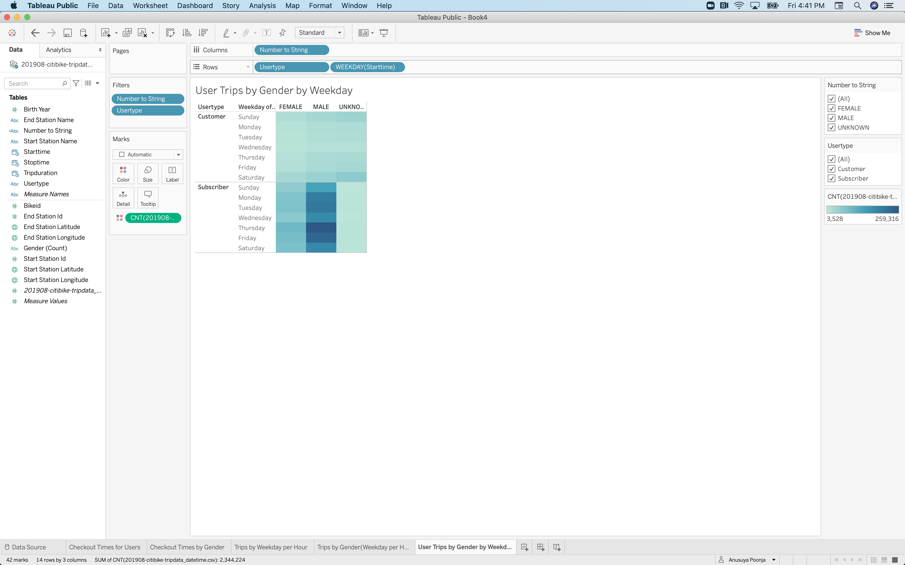
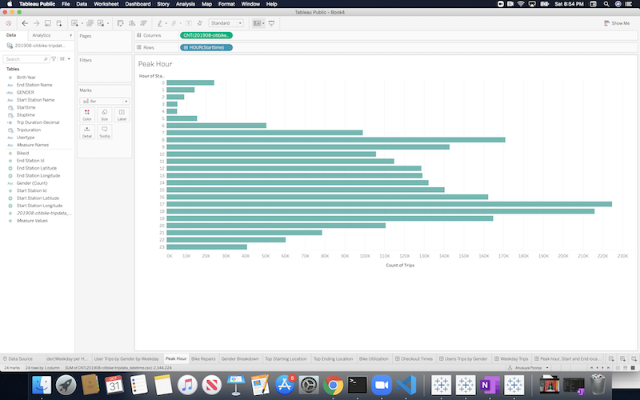
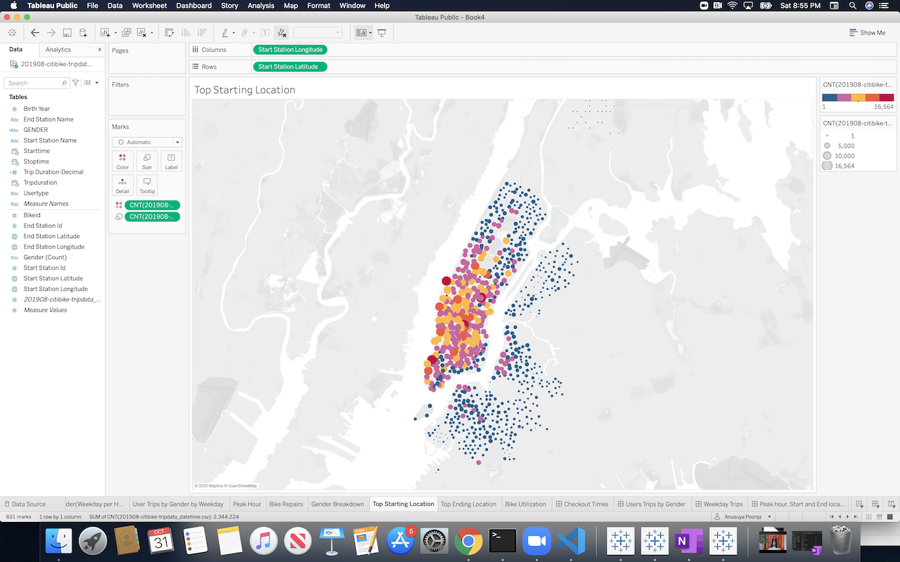

# NYC Citi bikesharing Analysis

## Overview of the Analysis

The purpose of this analysis is:
* To create a visualization story to convince investors about the bike-sharing program in Des Moines
* To create visualization sheets, workbooks and story from the available data source. 

## Results

NYC Citi Bikeshare Story can be found in the Tableau link below:
[NYC Citi Bikesharing Story](https://public.tableau.com/profile/anusuya.poonja#!/vizhome/NYCCitiBikesharingChallenge/NYCCitiBikishare)

### 1) Checkout Times for Users:
* The line graph displays the number of bikes checked out by duration for all users, and the graph can be filtered by the hour. 

The highest trip duration is between 4-6 hours and each minute close to 3K bikes are checkout out for that duration.

[Link to Checkout Times for Users](https://public.tableau.com/profile/anusuya.poonja#!/vizhome/NYCCitiBikeshare-Checkouttimes/CheckoutTimes)

### 2) Checkout Times by Gender:
*  Checkout Times by Gender line graph displays the number of bikes that are checked out by duration for each gender by the hour, and the graph can be filtered by the hour and gender. 

The line graph shows that the most bikes are checked out by MALE and the highest duration is in line with the overall checkout times. 
This shows that the MALE riders drive the overall count. The FEMALE graph also shows the maximum trip duration is between the 4-6 hours range.

[Link to Checkout Times by Gender](https://public.tableau.com/profile/anusuya.poonja#!/vizhome/NYCCitiBikeshare-Checkouttimes/CheckoutTimes)

### 3) Bike Trips for each hour by day:
* Bike Trips for each hour by day is a heatmap to show the number of bike trips for each hour of each day of the week. 

[Link to Bike Trips for each hour by day](https://public.tableau.com/profile/anusuya.poonja#!/vizhome/NYCCitiBikeshare-WeekdayTripsbyperhour/TripsbyWeekdayperHour)

### 4) Bike Trips by Gender for each hour of each day of the week:
✓A heatmap is created showing the number of bike trips by gender for each hour of each day of the week, and the heatmap can be filtered by gender. 

[Link to Bike Trips by Gender by hour by day ](https://public.tableau.com/profile/anusuya.poonja#!/vizhome/NYCCitiBikeshare-Tripsbygenderperhour/TripsbyGenderWeekdayperHour)

### 5) Bike Trips by User Type by Gender by weekday:
✓A heatmap is created showing the number of bike trips for each type of user and gender for each day of the week, and you can only filter by user AND gender.

[Link to Bike Trips by User Type by Gender by weekday](https://public.tableau.com/profile/anusuya.poonja#!/vizhome/NYCCitiBikeshare-Heatmapforeachtypebygenderbyday/UserTripsbyGenderbyWeekday)

### 6) 

[Link to Peak Hour Bar Chart](https://public.tableau.com/profile/anusuya.poonja#!/vizhome/NYCCitiBikesharingChallenge/NYCCitiBikishare)

### 7)

[Link to Starting and Ending Location](https://public.tableau.com/profile/anusuya.poonja#!/vizhome/NYCCitiBikesharingChallenge/NYCCitiBikishare)

## Summary:
This analysis included:

[link to dashboard](https://public.tableau.com/profile/anusuya.poonja#!/vizhome/NYCCitiBikesharingChallenge/NYCCitiBikishare)

[Additional Visualization](https://public.tableau.com/profile/anusuya.poonja#!/vizhome/NYCCitiBikeshare-Additionalvisualizations/Recommendation)

Results: Using the visualizations you have in your Tableau Story, describe the results of each visualization underneath the image.

Summary: Provide a high-level summary of the results and two additional visualizations that you would perform with the given dataset.
