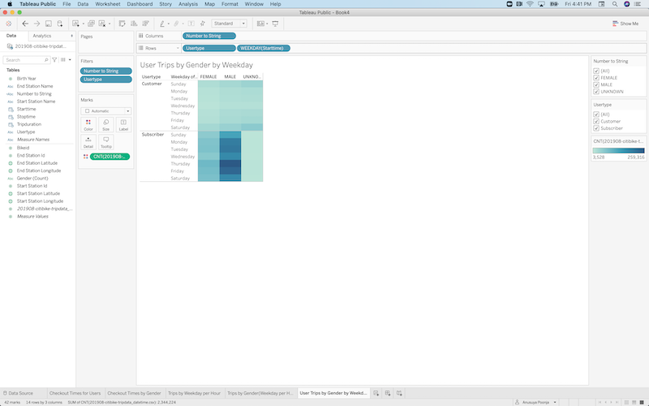
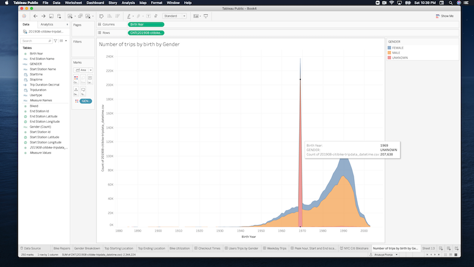
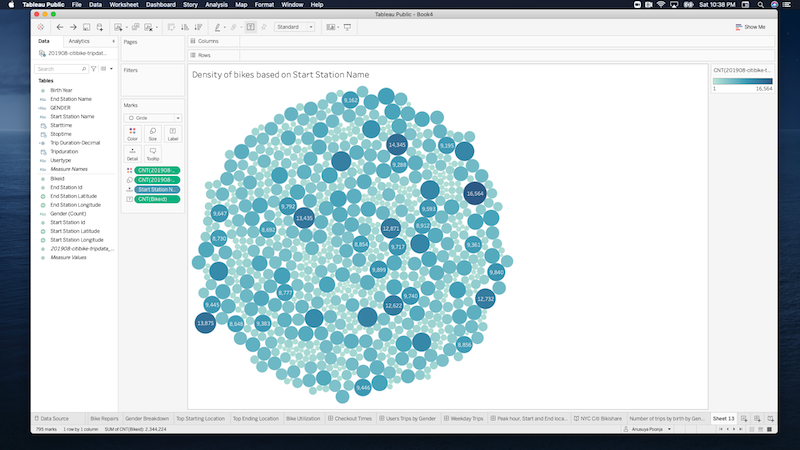

# NYC Citi bikesharing Analysis

## Overview of the Analysis

The purpose of this analysis is:
* To create a visualization story to convince investors about the bike-sharing program in Des Moines
* To create visualization sheets, workbooks and story from the available data source. 

## Results

NYC Citi Bikeshare Story can be found in the Tableau link below:
[NYC Citi Bikesharing Story](https://public.tableau.com/profile/anusuya.poonja#!/vizhome/NYCCitiBikesharingChallenge/NYCCitiBikishare)

### 1) Checkout Times for Users:
* The line graph displays the number of bikes checked out by duration for all users, and the graph can be filtered by the hour. 

The highest trip duration is between 4-6 hours and each minute close to 3K bikes are checkout out for that duration.

[Link to Checkout Times for Users](https://public.tableau.com/profile/anusuya.poonja#!/vizhome/NYCCitiBikeshare-Checkouttimes/CheckoutTimes)

### 2) Checkout Times by Gender:
*  Checkout Times by Gender line graph displays the number of bikes that are checked out by duration for each gender by the hour, and the graph can be filtered by the hour and gender. 

The line graph shows that the most bikes are checked out by MALE and the highest duration is in line with the overall checkout times. 
This shows that the MALE riders drive the overall count. The FEMALE graph also shows the maximum trip duration is between the 4-6 hours range.

[Link to Checkout Times by Gender](https://public.tableau.com/profile/anusuya.poonja#!/vizhome/NYCCitiBikeshare-Checkouttimes/CheckoutTimes)

### 3) Bike Trips for each hour by day:
* Bike Trips for each hour by day is a heatmap to show the number of bike trips for each hour of each day of the week. 

* The most trips are taken on Thursday.
* During the weekdays, the most trips are taken around 8am in the morning and between 5-6pm in the evening.
* The least number of biketrips are taken on Wednesday.
* Weekends trips are spread out between 10am to 6pm.

[Link to Bike Trips for each hour by day](https://public.tableau.com/profile/anusuya.poonja#!/vizhome/NYCCitiBikeshare-WeekdayTripsbyperhour/TripsbyWeekdayperHour)

### 4) Bike Trips by Gender for each hour of each day of the week:
*  This heatmap shows the number of bike trips by gender for each hour of each day of the week, and the heatmap can be filtered by gender. 

* Most number of trips are by MALE.
* The most trips are taken on Thursday.
* During the weekdays, the most trips are taken around 8am in the morning and between 5-6pm in the evening.
* The least number of biketrips are taken on Wednesday.
* Weekends trips are spread out between 10am to 6pm.

[Link to Bike Trips by Gender by hour by day ](https://public.tableau.com/profile/anusuya.poonja#!/vizhome/NYCCitiBikeshare-Tripsbygenderperhour/TripsbyGenderWeekdayperHour)

### 5) Bike Trips by User Type by Gender by weekday:
* This heatmap shows the number of bike trips for each type of user and gender for each day of the week, and you can only filter by user AND gender.

* Subribers make most trips than the customers.
* Most number of trips are by MALE.
* The most trips are taken on Thursday.
* During the weekdays, the most trips are taken around 8am in the morning and between 5-6pm in the evening.
* The least number of biketrips are taken on Wednesday.
* Weekends trips are spread out between 10am to 6pm.

[Link to Bike Trips by User Type by Gender by weekday](https://public.tableau.com/profile/anusuya.poonja#!/vizhome/NYCCitiBikeshare-Heatmapforeachtypebygenderbyday/UserTripsbyGenderbyWeekday)

### 6) Peak Hours:
* This bar chart shows the number of trips by the hour of starttime.

* The Starttime peaks at 8am in the morning and between 5-6pm in the evening.
* Over 200K bikes are checked out during peak hours in the evening.
* Most vehicles are checked out in the evening times between 4-7 pm.

[Link to Peak Hour Bar Chart](https://public.tableau.com/profile/anusuya.poonja#!/vizhome/NYCCitiBikesharingChallenge/NYCCitiBikishare)

### 7) Top Start location
* This map shows the density of Start Location of the bike rides.

* Maximum bikes have Start Location near Manhattan area.
* The density of number of bikes checked out around that area is above 10K bikes.

[Link to Starting and Ending Location](https://public.tableau.com/profile/anusuya.poonja#!/vizhome/NYCCitiBikesharingChallenge/NYCCitiBikishare)

### 8) Top End location
* This map shows the density of End Location of the bike rides.

* Maximum bikes have End Location near Manhattan area.
* The density of number of bikes turned in around that area is above 10K bikes.

[Link to Starting and Ending Location](https://public.tableau.com/profile/anusuya.poonja#!/vizhome/NYCCitiBikesharingChallenge/NYCCitiBikishare)

## Summary:

Here is the NYC Citi Bike Sharing Stroy:

[link to dashboard](https://public.tableau.com/profile/anusuya.poonja#!/vizhome/NYCCitiBikesharingChallenge/NYCCitiBikishare)

* Having a Bikeshare program in the New York city is very profitable and convinient.
* During peak hours over 200K bikes are checked out.
* The traffic is decent throughout the weekday and peaks at 8am and between 4-6pm.
* The weekend usage of the bikehare is pretty good and busy the whole day.

Two additional visualizations can be shown :

[Additional Visualization](https://public.tableau.com/profile/anusuya.poonja#!/vizhome/NYCCitiBikeshare-Additionalvisualizations/Recommendation)

* This visualization shows the Number of trips are highest by riders born in 1990.
* MALE riders checkout counts are higher than FEMALE, however the graphs are in line.
* Both MALE and FEMALE riders born around 1990 use the bikeshare the most.
* The graph shows a spike for riders born in the year 1969 and UNKNOWN gender, which looks to be skewed data.

* This visualization is helpful in knowing the density of bikes checked out by Station Name.
* Pershing Square North has most density of >16K bikes. This station is near the Grand Central Terminal.
* The Station at E 17th Street and Broadway has the density of >14K bikes.

